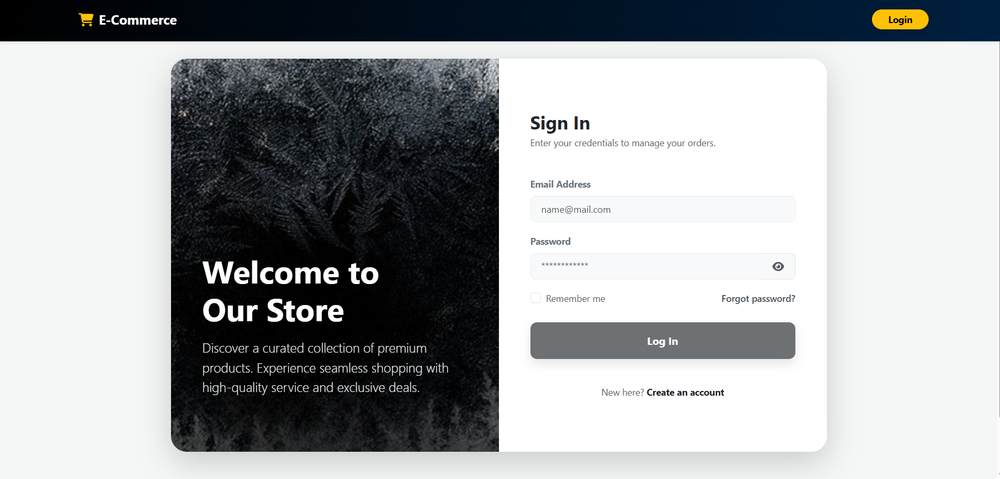
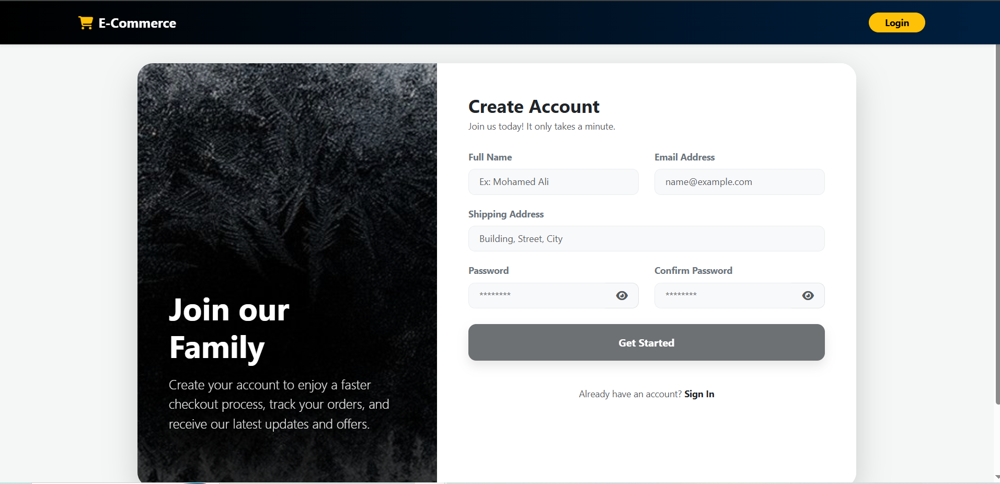
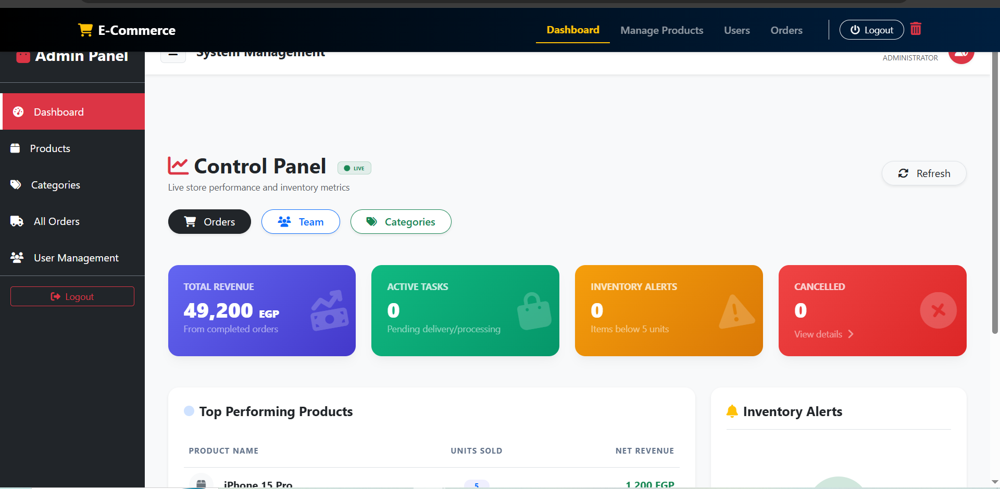
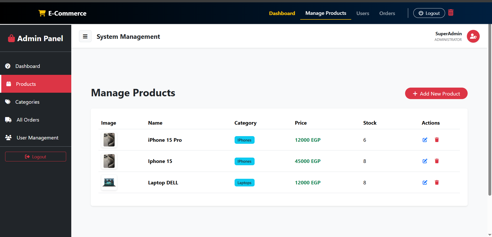
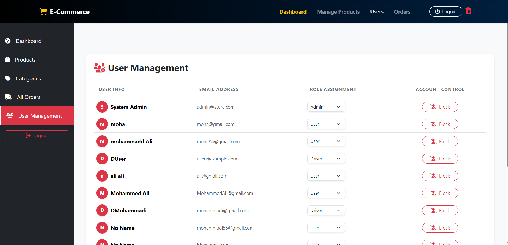
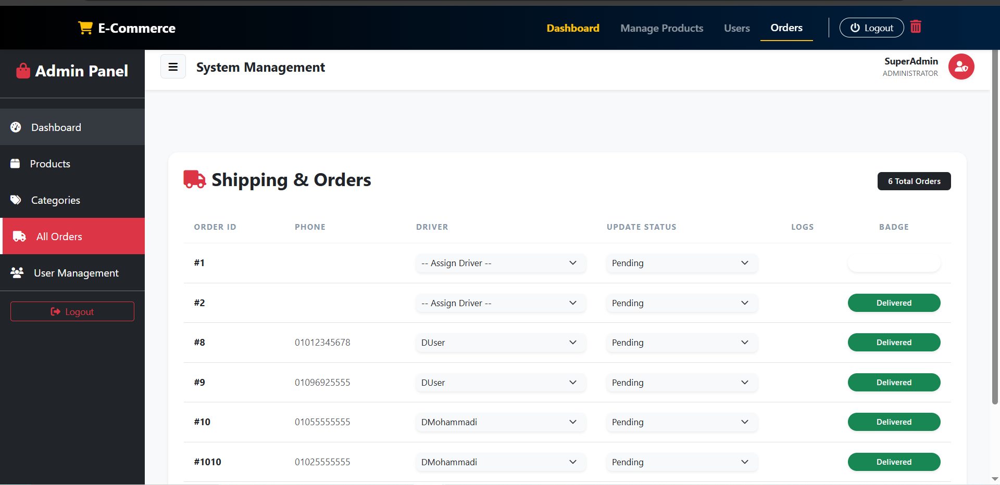
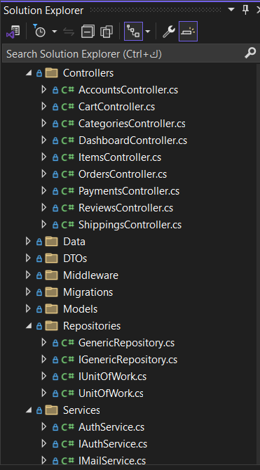
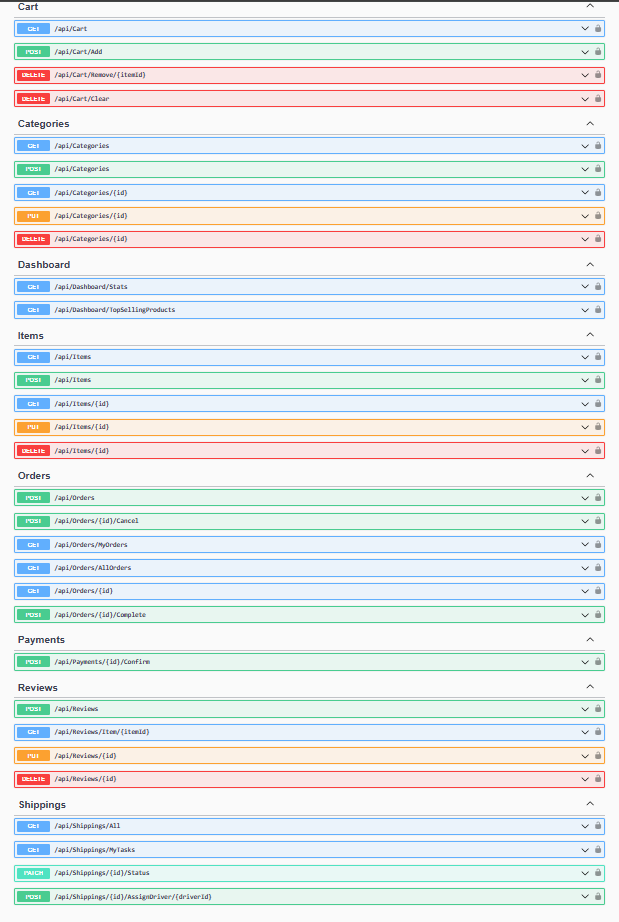

# 🛒 E-Commerce Full-Stack Solution

A professional, enterprise-level E-Commerce platform featuring a modern **Angular** storefront and a robust **.NET Core Web API** backend.

---

## 🏗️ Architectural Patterns (Backend)

The API is built with focus on scalability and clean code principles:

- **Generic Repository Pattern**: Centralizes data access logic to minimize redundancy.
- **Unit of Work**: Ensures data integrity by managing database transactions across multiple repositories.
- **DTOs (Data Transfer Objects)**: Optimizes data transfer and enhances security by decoupling internal models from the API response.

## 👥 User Roles & Permissions

- **Admin**: Complete management of products, categories, users, and global order monitoring.
- **Driver**: Specialized workflow to manage assigned shipments and update delivery statuses.
- **Customer**: Seamless shopping experience from product browsing to secure checkout and order tracking.

---

## 🖼️ Project Preview (UI & API)

### 🖥️ Admin Dashboard & Management

  
  

  
  

  
  

### 🔐 API Documentation (Swagger)

  
  

---

## ✨ Key Technical Features

- **Authentication**: Secure identity management using **JWT (JSON Web Tokens)**.
- **Frontend Architecture**: Built with Angular 17+, utilizing **Route Guards** for security and **HTTP Interceptors** for automated token management.
- **Database**: Managed via **Entity Framework Core** with SQL Server.

## 🚀 Tech Stack

- **Frontend**: Angular, Bootstrap 5, SweetAlert2, Reactive Forms.
- **Backend**: .NET 8 Web API, ASP.NET Core Identity.

---

## 🛠️ Setup & Installation

### 1. Backend (API)

1. Go to `E-CommerceApi/E-CommerceApi`.
2. Configure your connection string in `appsettings.json`.
3. Run `dotnet ef database update` followed by `dotnet run`.

### 2. Frontend (UI)

1. Go to `E-CommerceUi`.
2. Execute `npm install`.
3. Start the server with `ng serve`.

---

## 👤 Author

**Mohammadi Alaa** - _Full Stack .Net (Angular) Developer_
